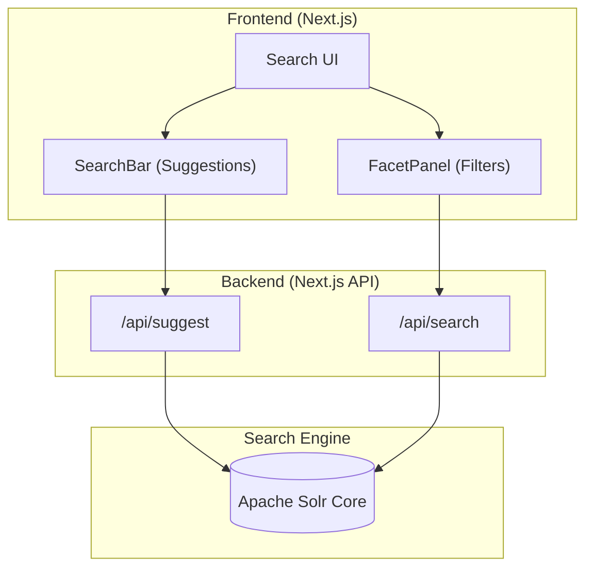

# NexaFind - Advanced Search Engine

NexaFind is a high-performance, faceted search application built using **Next.js** and **Apache Solr**. It provides a premium shopping-like search experience with real-time suggestions, dynamic filtering, and optimized search relevance.

## 🚀 Key Features
- **Full-Text Search**: Powered by Solr's `edismax` query parser for intelligent matching.
- **Dynamic Facets**: Instant filtering by Category, Brand, Price Range, and Stock Status.
- **Autocomplete Suggestions**: Real-time search suggestions as you type.
- **Advanced Sorting**: Sort results by Relevance, Price (High/Low), Rating, and Newest.
- **Responsive Design**: Modern, premium UI built with Tailwind CSS.

## 🛠️ Tech Stack
- **Frontend**: Next.js 15, React 19, Tailwind CSS
- **Search Engine**: Apache Solr 9.x
- **Language**: TypeScript

## 📂 Project Structure
- `/NexaFind`: The Next.js application (Frontend & API Routes).
- `/solr-data`: Contains Solr configuration (`schema.json`) and the dataset (`products.csv`).

---

## 🏗️ System Architecture


---

## 🏁 Getting Started

### Prerequisites
- [Node.js](https://nodejs.org/) (v18+)
- [Apache Solr](https://solr.apache.org/downloads.html) (v8.x or 9.x)

### 1. Clone the Repository
```bash
git clone https://github.com/Waleed987/NexaFind-OEL.git
cd NexaFind-OEL
```

### 2. Setup Apache Solr
Ensure Solr is installed and available in your system path.

```bash
# Start Solr service
[C:\Users\pc\Desktop\solr\solr-10.0.0\bin\solr.cmd (replace with your base path)] start -e cloud -y

# Create the 'products' core
[C:\Users\pc\Desktop\solr\solr-10.0.0\bin\solr.cmd (replace with base path)] create -c products

# Upload the schema (from the project root)
curl -X POST -H 'Content-type:application/json' --data-binary "@solr-data/schema.json" http://localhost:8983/solr/products/schema

# Index the product data
solr post -c products solr-data/products.csv
```

### 3. Setup the Frontend
```bash
# Navigate to the app directory
cd NexaFind

# Install dependencies
npm install

# Start the development server
npm run dev
```

### 4. Access the App
Open [http://localhost:3000](http://localhost:3000) in your browser.

---

## ⚙️ Configuration
By default, the app connects to Solr at `http://localhost:8983/solr`. You can customize this by creating a `.env.local` file in the `NexaFind` directory:

```env
SOLR_URL=http://localhost:8983/solr
SOLR_COLLECTION=products
```
